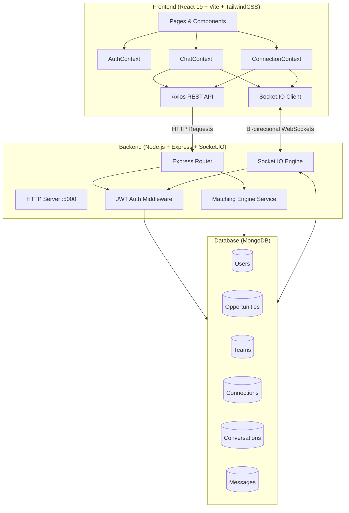

# 🚀 SkillBridge

### Unified Student Talent, Opportunity & Team Formation Platform

[](https://react.dev/)
[](https://nodejs.org/)
[](https://expressjs.com/)
[](https://www.mongodb.com/)
[](https://socket.io/)
[](https://tailwindcss.com/)
[](https://vitejs.dev/)

---

## 📖 Table of Contents

- [Executive Overview](#-executive-overview)
- [Key Features & Modules](#-key-features--modules)
  - [1. SkillMatch Engine (60/20/20 Algorithm)](#1-skillmatch-engine-602020-algorithm)
  - [2. OpportunityHub](#2-opportunityhub)
  - [3. TeamForge & Squad Assembly](#3-teamforge--squad-assembly)
  - [4. Real-Time Messaging Hub](#4-real-time-messaging-hub)
  - [5. Student Network & Connections](#5-student-network--connections)
  - [6. Sidebar AI Assistant](#6-sidebar-ai-assistant)
- [System Architecture](#-system-architecture)
- [Directory Structure](#-directory-structure)
- [Prerequisites & Requirements](#-prerequisites--requirements)
- [Step-by-Step Setup Guide](#-step-by-step-setup-guide)
  - [1. Clone Repository](#1-clone-repository)
  - [2. Backend Setup](#2-backend-setup)
  - [3. Seed Database](#3-seed-database)
  - [4. Frontend Setup](#4-frontend-setup)
  - [5. AI Assistant Microservice Setup](#5-ai-assistant-microservice-setup-port-5001)
- [Environment Configuration](#-environment-configuration)
- [Demo Accounts](#-demo-accounts)
- [REST API Reference](#-rest-api-reference)
- [Socket.IO Real-Time Protocol](#-socketio-real-time-protocol)
- [Standalone Gemini AI Assistant Microservice](#-standalone-gemini-ai-assistant-microservice-ai-assistant)
- [Technology Stack & Dependencies](#-technology-stack--dependencies)
- [Verification & Testing](#-verification--testing)
- [Production Deployment Guide](#-production-deployment-guide)
  - [1. Database (MongoDB Atlas)](#1-database-mongodb-atlas)
  - [2. Backend Web Service (Render / Railway)](#2-backend-web-service-render--railway--flyio--vps)
  - [3. Frontend Client (Vercel / Netlify)](#3-frontend-client-vercel--netlify--cloudflare-pages)
  - [4. AI Assistant Microservice](#4-ai-assistant-microservice-render--railway)
  - [Pre-Flight Deployment Checklist](#-pre-flight-deployment-checklist)


---

## 🌟 Executive Overview

**SkillBridge (Hackquire)** is a modern, full-stack collaborative ecosystem designed for universities, hackathons, and student developer communities. It bridges the gap between ambitious students seeking teammates and project organizers looking for top-tier talent.

Through a deterministic **60/20/20 Matchmaking Engine**, automated **Skill Gap Analysis**, **Real-Time WebSockets Messaging**, and **Opportunity Fit Scoring**, SkillBridge eliminates friction in team formation and unlocks cross-disciplinary student collaboration.

---

## 🎯 Key Features & Modules

### 1. SkillMatch Engine (60/20/20 Algorithm)

Matches students using a multi-factor weighted scoring formula:

- **60% Skill Complementarity**: Computes Jaccard similarity and unique skill overlap between two developer profiles.
- **20% Shared Interests**: Calculates thematic alignment across research domains, frameworks, and hackathon tracks.
- **20% Availability Pairing**: Measures weekly commitment overlap (hours/week) to ensure operational synergy.
- Provides **transparent match score breakdowns** and qualitative match reasons (_e.g., "Complementary Skills (React, Python), Shared Interest (AI)"_).

### 2. OpportunityHub

- Browse, filter, and post hackathons, startup projects, research internships, and open-source gigs.
- **Smart Fit Score**: Calculates candidate compatibility percentage against opportunity requirements.
- Built-in application workflow with status tracking (`pending`, `accepted`, `rejected`).
- Direct **"Message Organizer"** action on all opportunity detail pages.

### 3. TeamForge & Squad Assembly

- Create and manage hackathon squads and project teams.
- **Role Gap Analysis**: Detects unfilled positions (_e.g., UI/UX Designer, ML Engineer_) and flags squad readiness.
- **Auto-Match Candidates**: Suggests the best-fitting students across the platform for vacant squad roles.
- Squad invitation lifecycle: Send invites, review applicants, accept/decline members.
- Integrated **Team Chat** channel for all active squad members.

### 4. Real-Time Messaging Hub (`/messages`)

- Powered by **Socket.IO** with authenticated WebSockets and REST fallback.
- **Direct 1-on-1 Chats** with peer developers and organizers.
- **Team Squad Channels** for unified group discussions.
- **Live Features**:
  - Instant zero-reload message delivery.
  - Real-time online/offline presence indicators.
  - Live typing indicators (_"Priya Patel is typing..."_).
  - Double-check delivery & read receipts (`CheckCheck`).
  - Unread badge counters in top navbar and sidebar navigation.
  - Context drawer displaying peer skills, bio, portfolio, and squad rosters.

### 5. Student Network & Connections (`/network`)

- Dedicated connection hub to build student friend networks.
- One-click invitation flow: `Connect +` ➔ `Requested ⏳` ➔ `Connected ✓` + `Message 💬`.
- Tabbed views: **All Friends**, **Requests Received** (with instant Accept/Decline), **Sent Requests** (with Cancel), and **Find Peers**.
- Accepting a request automatically initializes a direct 1:1 conversation thread.

### 6. Sidebar AI Assistant

- Persistent AI guide embedded in the bottom-left sidebar navigation.
- Answers questions regarding team formation, role gaps, opportunity applications, and matchmaking rules.
- Non-intrusive drawer modal that never obstructs screen content or message inputs.

---

## 🏗 System Architecture



---

## 📁 Directory Structure

```text
Hackquire/
├── client/                     # React 19 Frontend (Vite)
│   ├── public/                 # Static public assets
│   ├── src/
│   │   ├── components/         # Reusable UI components
│   │   │   ├── ChatWidget.jsx        # AI Assistant drawer & trigger
│   │   │   ├── Modal.jsx             # Accessible popup modal wrapper
│   │   │   ├── Navbar.jsx            # Top navbar with live unread badges
│   │   │   ├── OpportunityCard.jsx   # Opportunity preview card
│   │   │   ├── Sidebar.jsx           # Collapsible navigation & AI card
│   │   │   ├── StudentCard.jsx       # Candidate card with dynamic actions
│   │   │   └── TeamCard.jsx          # Team card with chat & gap pills
│   │   ├── context/            # React Global State Providers
│   │   │   ├── AuthContext.jsx       # Authentication & JWT session
│   │   │   ├── ChatContext.jsx       # Real-time conversations & messages
│   │   │   └── ConnectionContext.jsx # Friend requests & network state
│   │   ├── pages/              # Application View Pages
│   │   │   ├── Dashboard.jsx         # Unified student dashboard
│   │   │   ├── Home.jsx              # Landing & marketing page
│   │   │   ├── Login.jsx             # User authentication login
│   │   │   ├── Messages.jsx          # Real-time Chat & Squad Hub
│   │   │   ├── Network.jsx           # Dedicated Connections & Friends
│   │   │   ├── Opportunities.jsx     # Opportunity discovery directory
│   │   │   ├── OpportunityDetails.jsx# Details, applicants & message
│   │   │   ├── Profile.jsx           # Student profile & portfolio editor
│   │   │   ├── Register.jsx          # New student registration
│   │   │   ├── SkillMatch.jsx        # 60/20/20 Matchmaking directory
│   │   │   └── TeamForge.jsx         # Squad management & gap analysis
│   │   ├── services/           # Network & API layers
│   │   │   ├── aiAssistantApi.js     # Rule-based AI Assistant query handler
│   │   │   ├── api.js                # Axios instance & REST service wrappers
│   │   │   └── socket.js             # Singleton Socket.IO connection client
│   │   ├── App.jsx             # Router definition & provider wrapping
│   │   ├── main.jsx            # Application root mount
│   │   └── index.css           # Global typography & Tailwind utilities
│   ├── package.json
│   ├── tailwind.config.js
│   └── vite.config.js
│
├── server/                     # Node.js + Express Backend
│   ├── config/
│   │   └── db.js               # MongoDB connection handler
│   ├── controllers/            # Route business logic handlers
│   │   ├── authController.js         # Register, login, profile queries
│   │   ├── connectionController.js   # Friend requests & status mappings
│   │   ├── conversationController.js # Direct & squad message dispatcher
│   │   ├── matchingController.js     # 60/20/20 algorithm execution
│   │   ├── opportunityController.js  # Opportunity CRUD & application
│   │   ├── teamController.js         # Squad assembly & gap analysis
│   │   └── userController.js         # User directory queries
│   ├── middleware/
│   │   └── auth.js             # JWT bearer verification middleware
│   ├── models/                 # Mongoose Data Schemas
│   │   ├── Connection.js             # Friendships & pending requests
│   │   ├── Conversation.js           # 1:1 & team message threads
│   │   ├── Message.js                # Chat messages & read receipts
│   │   ├── Opportunity.js            # Projects, hackathons, internships
│   │   ├── Team.js                   # Squads, vacancies, members
│   │   └── User.js                   # Student profiles, skills, portfolio
│   ├── routes/                 # Express API Endpoints
│   │   ├── authRoutes.js
│   │   ├── connectionRoutes.js
│   │   ├── conversationRoutes.js
│   │   ├── matchingRoutes.js
│   │   ├── opportunityRoutes.js
│   │   ├── teamRoutes.js
│   │   └── userRoutes.js
│   ├── services/
│   │   └── socketService.js    # Socket.IO rooms, broadcast, presence
│   ├── .env                    # Environment variables
│   ├── package.json
│   ├── seed.js                 # Complete database populator with mock data
│   └── server.js               # Express + HTTP + Socket.IO server entry
│
└── README.md                   # Complete Platform Documentation
```

---

## 💻 Prerequisites & Requirements

Ensure the following tools are installed on your machine:

- **Node.js**: `v18.0.0` or later (tested on Node v20/v22)
- **npm**: `v9.0.0` or later
- **MongoDB**: Local MongoDB instance running on `mongodb://127.0.0.1:27017` **OR** a cloud [MongoDB Atlas](https://www.mongodb.com/cloud/atlas) URI.

---

## ⚡ Step-by-Step Setup Guide

### 1. Clone Repository

```bash
git clone https://github.com/shaswat8584/Hackquire.git
cd Hackquire
```

### 2. Backend Setup

Navigate to the `server` directory and install dependencies:

```bash
cd server
npm install
```

Verify or create `server/.env`:

```env
PORT=5000
MONGODB_URI=mongodb://127.0.0.1:27017/skillbridge
JWT_SECRET=skillbridge_jwt_secret_key_2026_super_secure_key
NODE_ENV=development
```

### 3. Seed Database

Populate MongoDB with demo student profiles, opportunities, teams, connections, and starter conversations:

```bash
npm run seed
```

_(You will see `[Seed] Database seed completed successfully!`)_

Start the backend development server:

```bash
npm run dev
# Server will start on http://localhost:5000
```

### 4. Frontend Setup

Open a new terminal window, navigate to the `client` directory, and install dependencies:

```bash
cd ../client
npm install
```

Start the Vite development server:

```bash
npm run dev
# Vite will serve the client on http://localhost:5173
```

Open [http://localhost:5173](http://localhost:5173) in your browser!

---

## 🔑 Demo Accounts

All seeded accounts share the default password: **`password123`**

| Student Name      | Email Address         | Primary Role        | Key Skills                                    |
| :---------------- | :-------------------- | :------------------ | :-------------------------------------------- |
| **Shaswat Kumar** | `shaswat@example.com` | Fullstack Developer | React, Node.js, MongoDB, JavaScript           |
| **Rahul Sharma**  | `rahul@example.com`   | ML Developer / AI   | Python, Machine Learning, PyTorch, OpenCV     |
| **Aman Gupta**    | `aman@example.com`    | Frontend Specialist | React, Vue.js, Tailwind CSS, TypeScript       |
| **Priya Patel**   | `priya@example.com`   | Backend Architect   | Node.js, Express, PostgreSQL, Redis, Docker   |
| **Ananya Roy**    | `ananya@example.com`  | UI/UX Designer      | Figma, UI/UX Design, Wireframing, Prototyping |
| **Rohit Verma**   | `rohit@example.com`   | Mobile Developer    | Flutter, Dart, React Native, Firebase         |
| **Sneha Reddy**   | `sneha@example.com`   | Cloud & DevOps      | AWS, Docker, Kubernetes, CI/CD, Terraform     |

---

## 🔌 REST API Reference

### 🔐 Authentication (`/api/auth`)

- `POST /api/auth/register` — Register a new student profile.
- `POST /api/auth/login` — Authenticate and receive JWT token.
- `GET /api/auth/me` — Retrieve logged-in student profile.
- `PUT /api/auth/profile` — Update skills, availability, bio, and portfolio.

### 🧠 SkillMatch Engine (`/api/matching`)

- `GET /api/matching/students` — Retrieve ranked peers based on 60/20/20 algorithm.
- `GET /api/matching/opportunities` — Retrieve opportunities ranked by fit score.

### 💼 OpportunityHub (`/api/opportunities`)

- `GET /api/opportunities` — List all open opportunities (supports search & filter).
- `GET /api/opportunities/:id` — Get detailed opportunity with applicants.
- `POST /api/opportunities` — Create a new project/hackathon opportunity.
- `POST /api/opportunities/:id/apply` — Submit application with pitch note.
- `PUT /api/opportunities/:id/status` — Accept/reject applicant (creator only).
- `GET /api/opportunities/my/applications` — Get user's submitted applications.

### 🛡 TeamForge (`/api/teams`)

- `GET /api/teams` — List teams (all or user's squads).
- `GET /api/teams/:id` — Get team details, members, and gap analysis.
- `POST /api/teams` — Create a new team squad.
- `POST /api/teams/:id/invite` — Invite student to fill a vacancy.
- `POST /api/teams/:id/apply` — Apply directly to a team vacancy.
- `GET /api/teams/:id/gap-analysis` — Compute missing role gaps & candidate recommendations.

### 🤝 Connections & Friends (`/api/connections`)

- `GET /api/connections` — Get accepted friends and pending incoming/outgoing requests.
- `GET /api/connections/statuses` — Map of connection status by user ID for instant UI state.
- `POST /api/connections/request/:recipientId` — Send a friend connection request.
- `PUT /api/connections/:id/accept` — Accept connection request (auto-creates chat).
- `PUT /api/connections/:id/reject` — Decline connection request.
- `DELETE /api/connections/:id/cancel` — Cancel sent connection request.
- `DELETE /api/connections/:id` — Remove existing friendship.

### 💬 Real-Time Messaging (`/api/conversations`)

- `GET /api/conversations` — Retrieve all direct and squad conversations.
- `POST /api/conversations/direct/:recipientId` — Get or create 1:1 chat thread.
- `GET /api/conversations/team/:teamId` — Get or create squad group conversation.
- `GET /api/conversations/:id/messages` — Retrieve historical message feed.
- `POST /api/conversations/:id/messages` — Send a chat message with attachments.
- `PUT /api/conversations/:id/read` — Mark conversation messages as read.
- `GET /api/conversations/unread-total` — Total unread badge counter.

---

## ⚡ Socket.IO Real-Time Protocol

WebSockets connection is authenticated via JWT during handshake (`auth.token`).

### Client-to-Server Events

| Event                | Payload              | Purpose                            |
| :------------------- | :------------------- | :--------------------------------- |
| `join_conversation`  | `conversationId`     | Join active chat room channel.     |
| `leave_conversation` | `conversationId`     | Leave chat room channel.           |
| `typing_start`       | `{ conversationId }` | Broadcast typing status to peers.  |
| `typing_stop`        | `{ conversationId }` | Clear typing status indicator.     |
| `mark_read`          | `{ conversationId }` | Broadcast read receipt to senders. |

### Server-to-Client Events

| Event                         | Payload                            | Purpose                                          |
| :---------------------------- | :--------------------------------- | :----------------------------------------------- |
| `receive_message`             | `Message Object`                   | Instant delivery of incoming message.            |
| `conversation_updated`        | `Conversation Object`              | Updates last message snippet & order in sidebar. |
| `user_typing`                 | `{ conversationId, userId, name }` | Displays live _"User is typing..."_.             |
| `user_stopped_typing`         | `{ conversationId, userId }`       | Clears typing indicator.                         |
| `messages_marked_read`        | `{ conversationId, readBy }`       | Updates checkmarks to blue double ticks.         |
| `user_status_changed`         | `{ userId, isOnline }`             | Live green online presence update.               |
| `connection_request_received` | `Connection Object`                | Notification badge for new friend request.       |
| `connection_request_accepted` | `Connection Object`                | Real-time alert when friend accepts invitation.  |

---

## 🤖 Standalone Gemini AI Assistant Microservice (`ai-assistant/`)

SkillBridge includes a decoupled, reusable **AI FAQ & Support Assistant** microservice powered by the **Google Gemini API** (`@google/generative-ai`) and Express on port `5001`.

```text
                    AI ASSISTANT MODULE (ai-assistant/)
                                     |
                +--------------------+--------------------+
                |                                         |
     AI Assistant Client (Port 5174)           AI Assistant Server (Port 5001)
     (Standalone React + Vite)                 (Express REST API + Gemini SDK)
                                                          |
                                                          v
                                                  Google Gemini API

                                   ▲
                                   │ HTTP POST /api/chat
                                   │
              +--------------------+--------------------+
              |                                         |
     SkillBridge Main App                      External EdTech / University Portal
     (http://localhost:5173)                   (3rd-Party Consumer)
```

### Key Capabilities:
* **Grounded Knowledge Base**: Answers questions about SkillMatch scoring, team creation, vacancies, invitations, and application workflows using `ai-assistant/server/data/knowledgeBase.js`.
* **Zero Client-Side API Key Exposure**: The `GEMINI_API_KEY` is loaded exclusively on the backend server.
* **Deterministic Fallback**: If offline or if an API key is not supplied, the assistant uses local keyword-grounded responses to maintain high availability.
* **Multi-Tenant / Third-Party Support**: External portals can specify a `portalType` in their payload to query custom domain knowledge bases.

### AI Endpoints (`http://localhost:5001/api`):
* `GET /api/health` — Returns service status and port.
* `POST /api/chat` — Accepts `{ "message": "How do I create a team?" }` and returns `{ "success": true, "answer": "..." }`.

---

## 🛠 Technology Stack & Dependencies


### Frontend Architecture

- **React 19** (`^19.2.8`): High performance component rendering with modern hooks.
- **React Router DOM** (`^7.18.2`): Declarative client-side routing with layout guards.
- **Socket.IO Client** (`^4.8.3`): Persistent real-time WebSockets synchronization.
- **Axios** (`^1.19.0`): Promise-based HTTP client with auth interceptors.
- **Tailwind CSS** (`^3.4.17`): Utility-first modern responsive design system.
- **Lucide React** (`^1.33.0`): Consistent, accessible icon library.
- **Vite** (`^8.2.0`): Blazing-fast HMR and optimized production bundler.
- **Oxlint** (`^1.75.0`): High-speed Rust-based JavaScript & React linter.

### Backend Architecture

- **Node.js & Express** (`^4.21.2`): RESTful API server routing and middleware pipeline.
- **Socket.IO** (`^4.8.3`): WebSockets server with room multiplexing and JWT handshake validation.
- **Mongoose & MongoDB** (`^8.9.5`): Schema modeling, validations, and compound indexing.
- **JSONWebToken** (`^9.0.2`): Stateless cryptographic user authentication.
- **Bcryptjs** (`^2.4.3`): Salted password hashing and verification.
- **Cors** (`^2.8.5`): Cross-Origin Resource Sharing policy management.
- **Morgan** (`^1.10.0`): HTTP request logging for development.

### AI Assistant Microservice Architecture

- **Google Generative AI SDK** (`@google/generative-ai` `^0.24.1`): Official Google Gemini API client.
- **Express** (`^5.2.1`): Lightweight REST endpoint hosting on port 5001.
- **Dotenv** (`^17.4.2`): Environment variable loader.
- **Cors** (`^2.8.6`): Cross-origin resource sharing for external portal access.
- **Morgan** (`^1.11.0`): Request logging.


---

## 🧪 Verification & Testing

To test and verify the entire stack locally:

```bash
# 1. Run backend tests
cd server
node test_messaging.js

# 2. Run client linter
cd ../client
npm run lint

# 3. Test production build
npm run build
```

---

## 🚀 Production Deployment Guide

Deploying SkillBridge is straightforward. Because the platform uses **persistent WebSockets (`socket.io`)** and a **React 19 Single Page Application (SPA)**, follow these instructions for a smooth production rollout:

### 1. Database (MongoDB Atlas)
1. Create a free cluster on [MongoDB Atlas](https://www.mongodb.com/cloud/atlas).
2. Under **Network Access**, allow access from anywhere (`0.0.0.0/0`) or whitelist your hosting servers.
3. Under **Database Access**, create a user and copy the connection string:
   ```text
   mongodb+srv://<username>:<password>@cluster0.abcde.mongodb.net/skillbridge?retryWrites=true&w=majority
   ```

---

### 2. Backend Web Service (Render / Railway / Fly.io / VPS)
> ⚠️ **Important**: Deploy the backend as a **Web Service / Container** (NOT serverless functions like AWS Lambda or Vercel serverless) so that persistent WebSockets connections stay alive.

#### Deploy on [Render](https://render.com) (or [Railway](https://railway.app)):
1. Create a new **Web Service** and connect your GitHub repository.
2. Configure settings:
   - **Root Directory**: `server`
   - **Environment**: `Node`
   - **Build Command**: `npm install`
   - **Start Command**: `node server.js`
3. Add Environment Variables:
   | Variable | Value |
   | :--- | :--- |
   | `NODE_ENV` | `production` |
   | `PORT` | `5000` (or leave default assigned by host) |
   | `MONGODB_URI` | `mongodb+srv://...` (your Atlas URI) |
   | `JWT_SECRET` | A secure random 64-char string |
4. *(Optional Seed)*: In Render/Railway Shell, run `node seed.js` once to populate initial demo data.
5. Note your backend live URL: e.g. `https://skillbridge-backend.onrender.com`

---

### 3. Frontend Client (Vercel / Netlify / Cloudflare Pages)

#### Deploy on [Vercel](https://vercel.com):
1. Import your GitHub repository to Vercel.
2. Configure settings:
   - **Framework Preset**: `Vite`
   - **Root Directory**: `client`
   - **Build Command**: `npm run build`
   - **Output Directory**: `dist`
3. Add Environment Variables:
   | Variable | Value | Description |
   | :--- | :--- | :--- |
   | `VITE_API_URL` | `https://skillbridge-backend.onrender.com/api` | Your deployed backend API |
   | `VITE_SOCKET_URL` | `https://skillbridge-backend.onrender.com` | Your deployed WebSockets host |
   | `VITE_AI_ASSISTANT_URL` | `https://skillbridge-ai.onrender.com/api` | *(Optional)* Your AI assistant URL |
4. Deploy! *(The included [`vercel.json`](file:///d:/Hackquire/client/vercel.json) and [`_redirects`](file:///d:/Hackquire/client/public/_redirects) automatically handle SPA sub-route reloads so `/messages` and `/network` never 404).*

---

### 4. AI Assistant Microservice (Render / Railway)
1. Create a new **Web Service** with **Root Directory**: `ai-assistant/server`.
2. **Build Command**: `npm install`
3. **Start Command**: `node server.js`
4. Set Environment Variables:
   - `PORT`: `5001`
   - `GEMINI_API_KEY`: Your Google Gemini API key from [Google AI Studio](https://aistudio.google.com/).

---

### ✅ Pre-Flight Deployment Checklist
* [x] MongoDB Atlas network whitelist configured (`0.0.0.0/0`).
* [x] Backend deployed as a persistent Web Service with WebSockets enabled.
* [x] Client environment variables (`VITE_API_URL`, `VITE_SOCKET_URL`) set to HTTPS backend URL.
* [x] SPA rewrite rules verified ([`vercel.json`](file:///d:/Hackquire/client/vercel.json) / [`_redirects`](file:///d:/Hackquire/client/public/_redirects)).
* [x] Mixed content checked: Frontend on HTTPS must point to Backend on HTTPS (`https://` and `wss://`).

